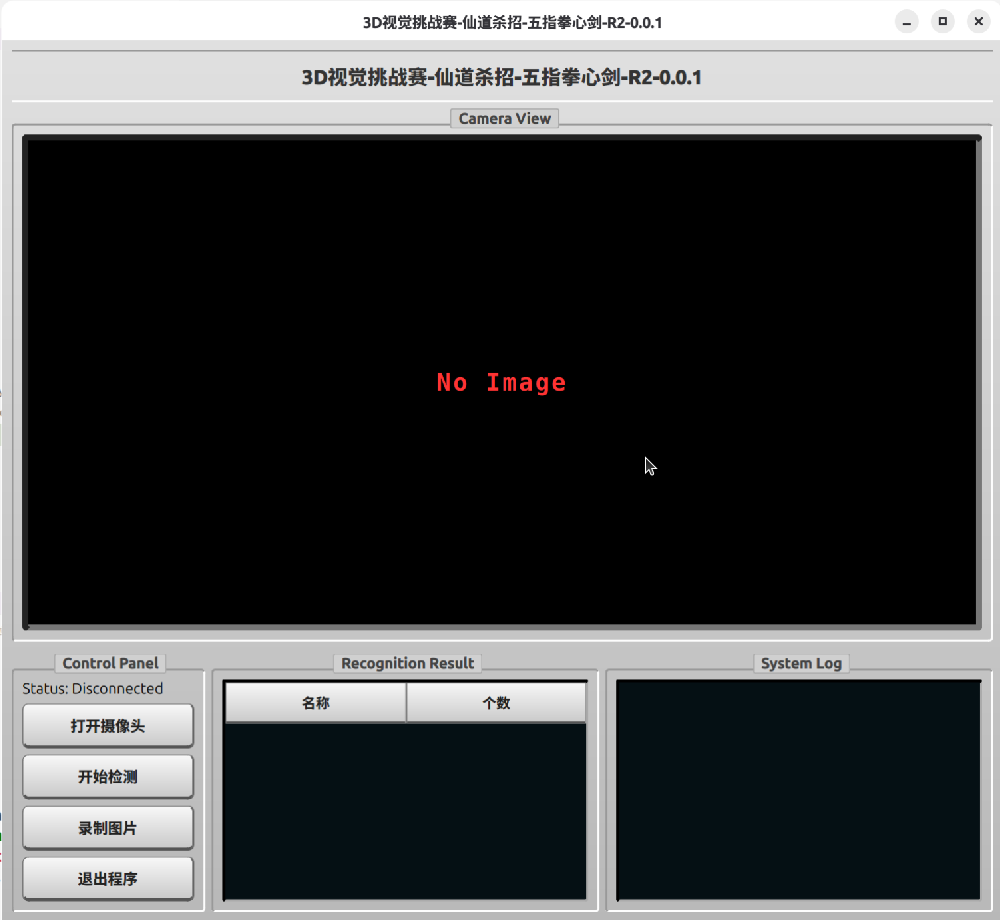
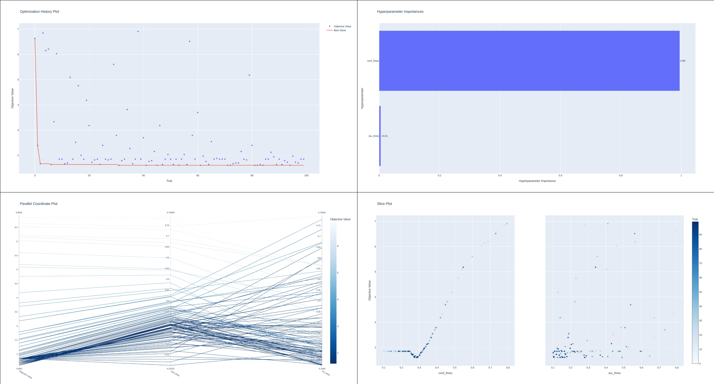

# 🤖 3D Robot Vision Template

> **中国机器人大赛暨 RoboCup 机器人世界杯中国赛 - 机器人先进视觉赛项 核心模板代码**

[](https://www.python.org/)
[](https://github.com/astral-sh/uv)
[](LICENSE)

本项目专为 RoboCup 机器人先进视觉赛项设计，提供了一套从**数据采集、模型推理、多线程 GUI 交互**到**超参数自动寻优**的完整解决方案。



## ✨ 核心特性

- ⚡ **极致的性能剖析**：深度集成 VizTracer，支持纳秒级多线程时间线可视化，精准定位 UI 卡顿与推理瓶颈。
- 🔍 **数据驱动的调优 (Data-Driven Optimization)**：摒弃“炼丹式”调参，内置基于 Optuna 的自动超参数寻优系统，提供多维度的可视化分析报告。
- ☁️ **端云协同架构 (WebModel)**：针对弱网环境优化，实现了与本地 YOLO 完全一致的 API 接口，传输带宽占用降至最低。
- 🧩 **高内聚低耦合**：算法逻辑 (`DetectionPipeline`) 与图形界面彻底解耦，支持无头模式 (Headless) 运行与自动化测试。

## ⚙️ 环境与硬件要求
- **操作系统**：Ubuntu24.04, Windows(理论支持), Orange Pi OS(理论支持)
- **计算设备**：Orange Pi AI Pro(理论支持), 个人笔记本电脑
- **相机硬件**：需提前安装 [Orbbec Astra SDK](链接) 及对应驱动(未测试)

## 🛠️ 安装说明

本项目推荐使用下一代极速 Python 包管理器 [uv](https://github.com/astral-sh/uv) 进行环境配置。

```bash
# 1. 克隆仓库
git clone -b devel-ms https://github.com/lovedream-ms/3D.git
cd 3D

# 2. 同步并安装依赖
uv sync
```

## 🚀 快速开始
本项目提供了多个维度的启动脚本，以适应不同的开发与调试阶段：
### 1. 运行主控程序 (GUI 模式)

启动包含完整监控面板、检测逻辑与 Socket 通讯的上位机界面：

```bash
uv run src/Main.py
```
### 2. 性能剖析模式 (Timeline Profiling)
使用 [viztracer](https://github.com/gaogaotiantian/viztracer) 启动程序，运行结束后将自动在浏览器中打开 timeline.html 交互式时间线报告：

```bash
uv run viztracer -o results/human/timeline.html --open --log_gc src/Main.py
```
<details>
<summary>👉 点击展开 VizTracer 快捷键与使用技巧</summary>
VizTracer 快捷键指南：

W / S：放大 / 缩小 | A / D：向左 / 向右平移时间轴。

鼠标左键拖拽：框选特定时间段，查看区域内的统计信息。

点击任意色块：在界面下方查看该函数的名称、所在文件、行号及精确耗时。

</details>

### 3. 超参数自动优化 (Optimize)

基于真实测试集，自动迭代并寻找最优的参数组合，最终生成 assets/best-param.json 及分析图表：

```bash
PYTHONPATH=src uv run tools/optimize.py
```

## 📂 目录结构

```sh
3D/
├── .github                      # GitHub 配置文件与 CI/CD 工作流
├── .venv                        # Python 虚拟环境目录 (由 uv 自动生成)
├── assets                       # 静态资源目录 (存放 README 图片、预设参数 json 等)
├── datasets                     # 数据集存储目录 (存放带真值的场景 npz 文件)
├── libraries                    # 第三方硬件依赖库 (Astra SDK / RealSense SDK 等)
├── models                       # 模型权重文件存储目录 (.pt, .onnx, .om 等)
├── results                      # 运行结果与分析报告输出目录
│   ├── human                    # 人工可读结果 (如 VizTracer 与 Optuna 生成的 HTML 图表)
│   └── machine                  # 机器可读结果 (如序列化的测试评估数据)
├── src                          # 🚀 项目核心源码目录
│   ├── Camera/                  # 相机模块
│   ├── Config.py                # 全局配置类 (VisionConfig 超参数与阈值定义)
│   ├── DatasetLoader.py         # 离线数据集加载器 (用于复现测试与自动寻优系统)
│   ├── DetectionPipeline.py     # 核心算法流 (与 GUI 解耦的检测、裁剪、多模态处理逻辑)
│   ├── Main.py                  # 主控程序入口 (启动 GUI 界面与多线程架构)
│   ├── ServelModel.py           # 端云协同服务端
│   ├── Socket.py                # 网络通讯模块 (与机器人下位机或主控板通信)
│   ├── Utils.py                 # 通用工具函数
│   └── YoloModel.py             # AI 推理引擎封装层 (支持本地模型与 WebModel)
├── test                         # pytest 单元测试与基准测试脚本目录
├── tools                        # 🛠️ 快捷操作与开发辅助工具
│   ├── img2npy.py               # 数据格式转换脚本 (将采集图片打包为 datasets 格式)
│   ├── optimize.py              # 超参数自动优化启动脚本 (基于 Optuna 的数据驱动调优)
│   ├── run.sh                   # 一键运行 Shell 脚本
│   └── trans.sh                 # 快捷模型转换脚本
└── README.md                    # 项目说明文档
```

## 🧠 边缘端部署与模型架构

### 1. 通过`omEngine`使得[ultralytics](https://docs.ultralytics.com/zh/)兼容昇腾 (Ascend) NPU 硬件加速兼容
 
> https://github.com/TongDog/ultralytics-Ascend 

TODO: 可以参考是否完善,如果完善可以借用

### 2. WebModel：突破边缘设备启动瓶颈

为了让**WebModel**拥有和**YoloModel** 完全相同的接口（输入 cv2 图像，输出纯正的 ultralytics.engine.results.Results 对象），并且可以直接调用 result.show()，我们需要解决前后端通信与数据结构一致性的问题。
<details>
<summary>👉 点击查看 WebModel 原理与核心代码</summary>
##### 客户端代码 (src/WebModel.py)
```python
class WebModel:
    ...
    def predict(self, frame) -> Results:
        # 将 numpy 数组压缩为 JPEG 字节流 (极大地节省网络传输带宽)
        success, img_encoded = cv2.imencode('.jpg', frame)
        if not success:
            raise ValueError("图像编码失败")

        files = {"file": ("image.jpg", img_encoded.tobytes(), "image/jpeg")}
        response = requests.post(self.url, files=files, params=self.params)
        # 反序列化服务端传回的 bytes，直接还原成 Ultralytics 的 Results 对象
        result = pickle.loads(response.content)
        # 【核心细节】因为为了省带宽，服务端把原图置空了，在本地把原始图像重新塞回对象里
        result.orig_img = frame
    ...
```

##### 服务端代码(src/server.py)
```python
@app.post("/predict")
async def predict_api(file: UploadFile = File(...)):
    contents = await file.read()
    nparr = np.frombuffer(contents, np.uint8)
    img = cv2.imdecode(nparr, cv2.IMREAD_COLOR)

    results = server_model.predict(img)
    res: Results = results[0]

    res.orig_img = None

    return Response(content=pickle.dumps(res), media_type="application/octet-stream")
```
</details>

## 数据驱动的超参数优化系统

摒弃“炼丹式”的手动调参！本项目基于真实数据集，通过 Optuna 自动迭代寻找最优的参数组合。

<details>
<summary>👉 点击查看优化系统实现思路</summary>

1. 解耦算法与GUI(hash:): 实现`DetectionPipeline.py`
2. 定义配置类`VisionConfig`
3. 定义optimize.py

</details>



1. 📉 优化历史图 (History)：观察算法是否收敛，是否存在极大的随机性。
2. 📊 参数重要性图 (Importance)：直观显示哪个参数（如 conf_thres）对降低误差的贡献最大。
3. 🎯 切片图 (Slice)：寻找误差最小且最密集的“甜点区 (Sweet Spot)”，防止边界效应。
4. 🕸️ 平行坐标图 (Parallel)：发掘参数间的隐藏配合逻辑（例如低置信度必须配高 IoU）。

<details>
<summary>👉 点击查看AI提供的详细解释</summary>

#### 1. 优化历史图(opt_history.html)

横坐标是试验次数 (Trial 0, 1, 2...)，纵坐标是误差值 (Error)。图上会有散点，以及一条不断下降的折线（代表当前发现的最小误差）。
- 看收敛速度：如果前 10 次试验误差是 20，到第 30 次突然降到 1 并保持平稳，说明算法已经“找到了感觉”（收敛了）。
- 看是否存在随机性：如果散点上下乱跳，说明你的模型对某些参数极其敏感。
- 如果发现跑到第 10 次折线就不再下降了，说明 n_trials=10 基本够用了；如果到最后一次还在明显下降，下次请把 n_trials 加大到 50 或 100。

#### 2. 参数重要性图(opt_importance.html)

一张柱状图，列出了 conf_thres 和 iou_thres。它们的值加起来等于 1.0 (或 100%),直接告诉你哪个参数对降低误差的贡献最大。

场景推演：如果 conf_thres 的重要性高达 0.85，而 iou_thres 只有 0.15。这说明在你的比赛台面上，物体基本都是分开摆放的（几乎没有重叠掩盖），所以 NMS 的 IoU 阈值怎么调都无所谓；但光照变化大，导致模型的置信度波动，所以置信度阈值成了决定生死的关键。

#### 3. 平行坐标图(opt_parallel.html) 

图上有几根垂直的轴（代表各个参数和最终误差），很多条彩色的线穿过这些轴。深色/蓝色的线代表优秀的试验（误差低），浅色/红色的线代表糟糕的试验。
这是为了看参数之间的配合。
场景推演：你可能会顺着深色的线发现一个规律：“哦！原来当 conf_thres 设得特别低（误报多）的时候，必须把 iou_thres 设得特别高（合并严格），两者配合才能打出最低的误差！”
它能帮你发现那种“只有 A 和 B 同时满足某种条件时才有效”的隐藏逻辑。

#### 4. 切片图(opt_slice.html) 

每个超参数都有一个独立的小图。横坐标是参数的值（比如 0.1 ~ 0.8），纵坐标是误差。每个点代表一次试验

你的目标是寻找最低点（误差最小）最密集的区域，这就是“甜点区 (Sweet Spot)”。
比如你看 conf_thres 的切片图，如果发现当值在 0.1 ~ 0.2 之间时，所有的点都落在了最低端（误差为 1.0）；而当值大于 0.4 时，误差直接飙升到 10。这说明你的 YOLO 模型在这个场景下普遍不太自信，必须把阈值压得很低。
行动指南（防边界效应）：如果发现所有最优的点都紧紧贴在最左侧（比如全都挤在 0.1 上），这说明真正的最优解可能在 0.1 之外！下次修改代码，把范围放宽到 trial.suggest_float("conf_thres", 0.01, 0.8)。
</details>

## 数据集规范
```sh
your_project/
├── dataset/
│   ├── scene_001_table1_easy/     # 场景1：1号台，光照好，无遮挡
│   │   ├── T1-10:01:00.npz
│   │   ├── T1-10:01:02.npz
│   │   └── gt.json                # 内容: {"CA001": 2, "CB001": 1}
│   │
│   ├── scene_002_table2_hard/     # 场景2：2号台，有严重遮挡
│   │   ├── T2-10:05:00.npz
│   │   ├── T2-10:05:02.npz
│   │   ├── T2-10:05:04.npz
│   │   └── gt.json                # 内容: {"CA002": 3}
│   │
│   └── scene_003_table3_empty/    # 场景3：3号台，空台面（用于测试误报率）
│       ├── T3-10:10:00.npz
│       └── gt.json                # 内容: {}
```

## 二次开发

如果想要将本套件应用在实际比赛中，建议从**速度**与**精度**两个维度进行二次优化。本项目已为你铺平了基础设施（如 AI 异步推理、开机预热、Timeline 分析），你可以在此基础上进行以下尝试：

使用已实现清单举例:
- [x] 录制相机以后发布旋转指令,旋转期间进行AI推理
- [x] 使用WebModel进行开机自启动和预热,极大的节省时间
- [x] 使用timeline进行运行时间分析,辅助进行代码时间优化
- [x] 数据驱动的超参数优化系统进行精度优化

|  优化维度  | 💻 代码/策略层级的优化 | 🤖 模型/数据层级的优化 |
| :---: | :---: | :---: |
| **⚡&nbsp;速&nbsp;度**    | 借助 VizTracer 分析火焰图，减少主循环中的不必要深拷贝与冗余计算。 | 替换更轻量级的 YOLO 权重（如 YOLOv8n），或使用 TensorRT/OpenVINO 进行模型量化。 |
| **🎯&nbsp;精&nbsp;度**    | **级联策略**：在 `src/DetectionPipeline.py` 中，可实现“先检测桌面边缘 -> 裁剪图像 -> 再进行物体识别”的二次过滤。 | **多模态融合**：拍摄更多带干扰、遮挡的场景数据集；尝试引入 Seg (分割) 或 Pose (姿态) 模型替代纯目标检测。 |

> 💡 **参考方案**：结合本框架的精度优化实战案例，可参考分支仓库 [lqx943576099/3D](https://github.com/lqx943576099/3D)。

## 📅 迭代规划 (TODO)
- [ ] **UI/UX 升级**：提供更多现代化的 Qt QSS 界面风格切换
- [ ] **系统级集成**：编写 Linux `systemd.service` 脚本，支持开机自启动模型服务
- [ ] **健壮性优化**异常追加
- [ ] **网络通信**：支持跨设备的推理结果文件传输
- [ ] **可观测性**：引入高级日志库 (如 Loguru) 进行日志轮转与分级记录
- [ ] **硬件生态**：加入相机驱动部分

## 💬 参与贡献与交流
欢迎提交 Issue 报告 Bug 或提出 Feature 请求！如果你在 RoboCup 备赛过程中有好的优化策略，也非常欢迎提交 Pull Request。
如果本项目对你的比赛有帮助，请右上角点个 **⭐ Star** 支持一下！

